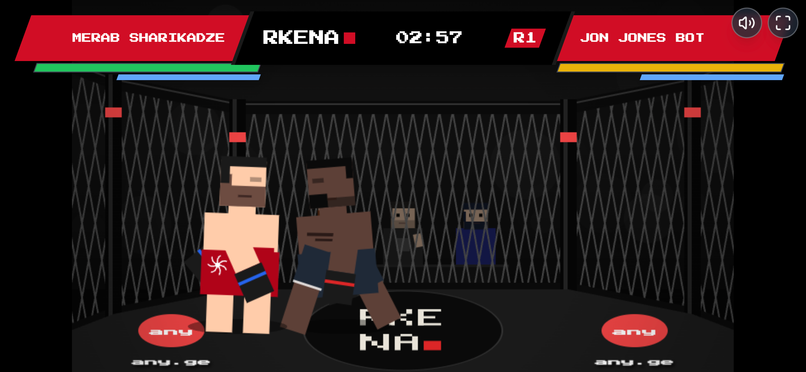

# RKENA MMA

This game is inspired by RKENA Georgian MMA (Rkena Fighting Championship).

**Author:** KAKHA13  
**Link:** [any.ge](https://any.ge)  
**Demo:** [rkena.any.ge](https://rkena.any.ge/)



## Features

- **8 selectable fighters** with unique stats, styles, signature specials and AI personalities — any vs. any matchups
- **Two game modes:** Quick Fight and a 4-fight **Tournament ladder** with escalating difficulty
- **Deep combat system:**
  - Punch, kick, block and takedown
  - **Dodge** with invincibility frames — slip a strike to earn a **counter** damage bonus
  - **Parry** — block at the last instant to stun your opponent
  - **Rocked state** — chain hits to put your opponent on wobbly legs for bonus damage
  - Combo system with damage scaling, knockback, stamina management and a power meter for specials
- **Arcade juice:** hitstop, screen shake, KO slow-motion camera, round intro countdowns, live commentators
- **Career record** (wins / losses / KOs / best combo / tournaments) saved locally, plus post-fight stat sheets
- Full keyboard + touch controls, pause, retro pixel look with synthesized sound effects

## Controls

| Key | Action |
| --- | --- |
| ← → | Move |
| Q | Punch |
| W | Kick |
| E | Block (last-instant = parry) |
| R / ↓ | Takedown |
| S / ↑ | Dodge |
| A | Special (when power meter is full) |
| P / Esc | Pause |

## Development

```bash
npm install
npm run dev     # local dev server
npm run build   # production build
```
